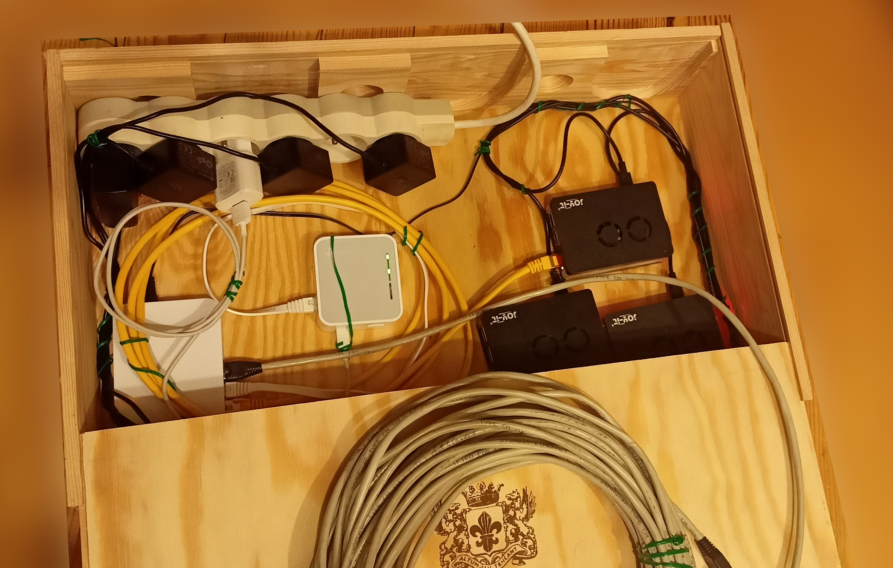
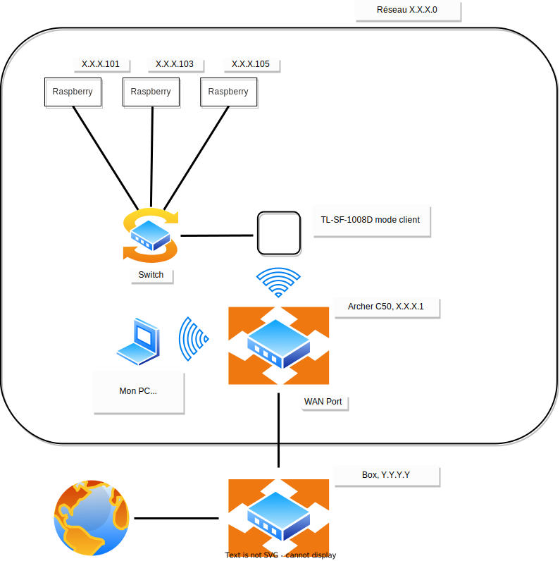
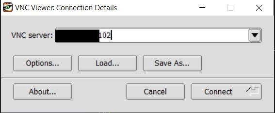
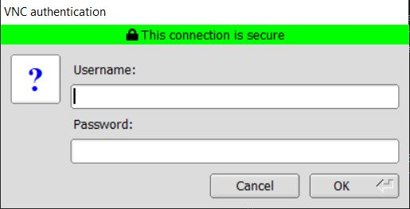

# Introduction
J'ai décidé de créer un cluster de raspberry pi. Le but de ce projet est d'avoir à portée de main un cluster physique disponible à portée de main pour me former en administration système et en réseau sur un cluster de machines.

Ce repository évoluera et grandira au gré des projets et nouvelles idées : Je vais me concentrer sur la partie systèmes et réseaux pour l'instant. Je garde en tête l'idée originale du projet de tester un cluster MongoDB, ELK ou encore Kubernetes sur plusieurs noeuds.



<br/>

# Coûts et démarche personnelle

Il est à noter que ce projet a un certain coût financier et environnemental : J'ai décidé d'acheter l'ensemble des équipements dont j'avais besoin sur LeBonCoin pour économiser et ne pas acheter inutilement des équipements neufs.

Attention, si les cartes constituent le facteur de coût prépondérant, il faudra tout de même penser aux câbles ethernet, à la/les multiprises éventuelles, au switch, etc ...

Les coûts sont ceux auquels j'ai achété mon matériel sur LeBonCoin.
| Equipements        | Utilité | Nombre      |Commentaires      | Coût unitaire | Coût total |
| ------| ------|-----|-----|-----|-----|
| raspberry pi 4 Go RAM|Evidente|3|Le coût comprend aussi l'alimentation, les boîtiers et les cartes SD 32 Go|61.6€|185€|
| TL-WR902AC|Communiquer avec le routeur principal en mode client |1||8€|8€|
| Archer C50|Routeur principal connecté en filaire avec la box |1||3€|3€|
| TL-SF-1008D 10/100Mbps|Switch pour connecter le routeur client avec les cartes en filaire  |1||3€|3€|
| Câbles ethernet||3||1€|3€|
| Boîte en bois|Stockage |1|Je vous conseille de chercher les boîtes pour bouteilles de vin|5€|5€|

Au total, on atteint environ 210€.

# Réseau

Je conseille une installation qui ne soit pas directement connectée en filaire à une box pour des raisons pratiques.

Pour cela, je conseille un routeur qui soit connecté en filaire à la box et un routeur client connecté en filaire aux cartes. L'intérêt est de pouvoir transporter et d'installer aisèment le cluster où l'on souhaite et d'y avoir accès à distance. 

Evidemment, le débit sera dépendant des performance du routeur client et du switch avec une telle installation.

J'ai gardé le DHCP sur le Archer C50 et j'ai associé une adresse ip fixe pour chaque interface réseau de chaque carte (y compris les interfaces wifi, c'est utile lors du setup pour savoir à qui on s'adresse).

<br/>


Note : Petite erreur, les adresses ip des cartes sont 102, 104, 106.

<br/>

# Accès à distance 

Il faut activer le SSH lors de la configuration de la carte SD ou dans le menu de configuration (et VNC si nécessaire).

Pour créer et partager votre clé publique depuis un OS windows vers une des cartes pour vous connecter sans mot de passe :

```powershell
ssh-keygen
```

```powershell
type $env:USERPROFILE\.ssh\id_rsa.pub | ssh X.X.X.101 "cat >> .ssh/authorized_keys"
```

## VNC

Pour les releases de TigerVNC :
https://github.com/TigerVNC/tigervnc/releases




## RDP

```bash
sudo apt install xrdp
```

Attention, à bien quitter les autres terminaux (VNC et/ou ssh) pour ne pas avoir d'écrans blancs.

Ecran de connexion :


