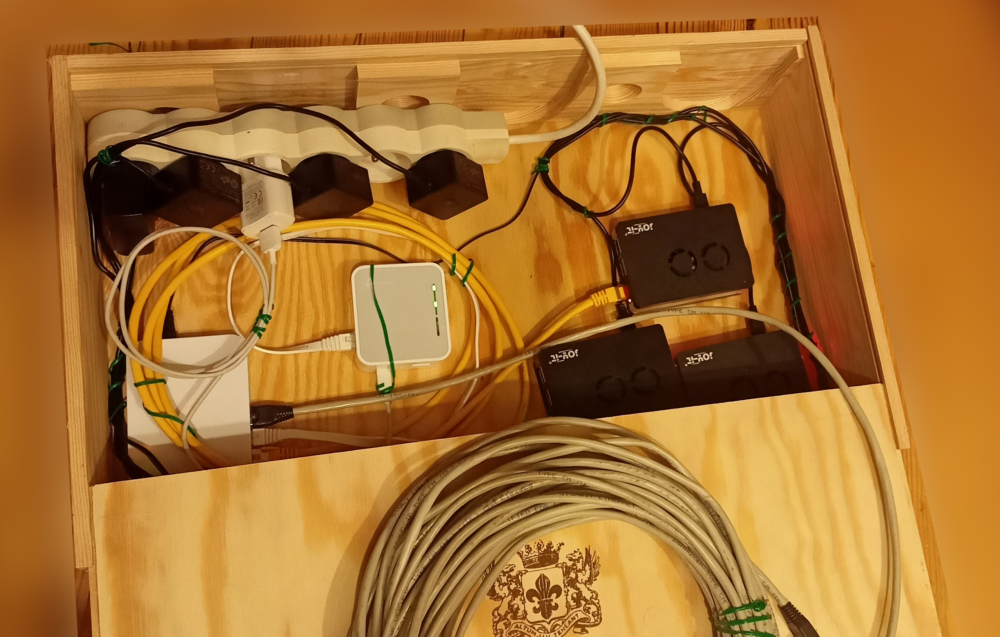
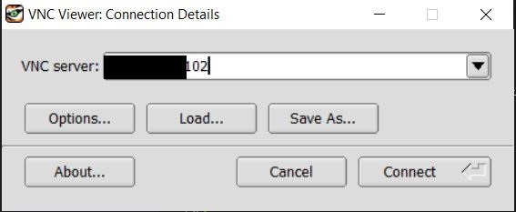
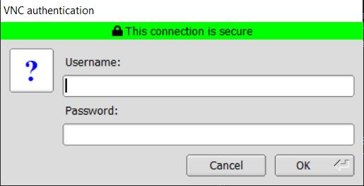
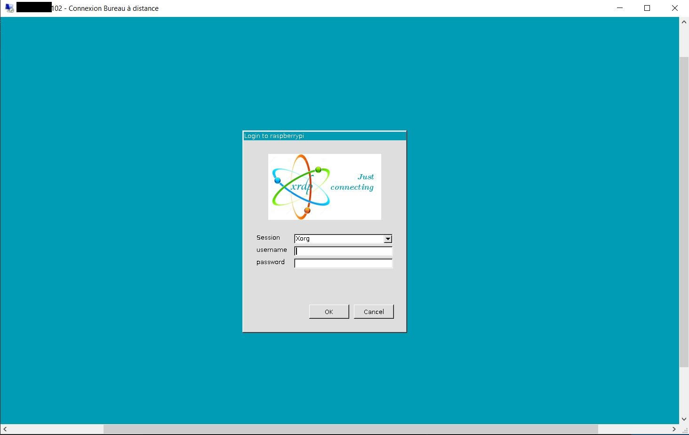
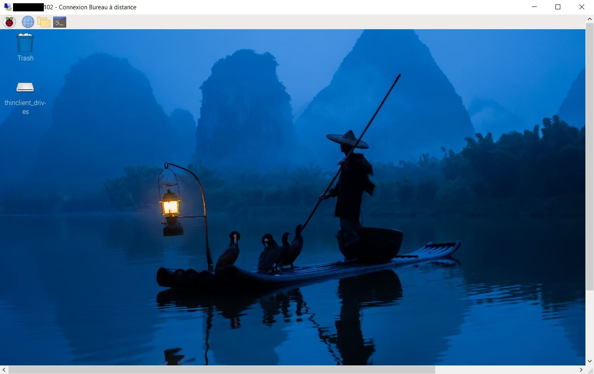

# Introduction
J'ai décidé de créer un cluster de raspberry pi. Le but de ce projet est d'avoir à portée de main un cluster physique pour me former en administration système et en réseau sur un cluster de machines.

Ce repository évoluera et grandira au gré des projets et nouvelles idées : Je vais me concentrer sur la partie systèmes et réseaux pour l'instant. Je garde en tête l'idée originale du projet de tester un cluster MongoDB, ELK ou encore Kubernetes sur plusieurs noeuds.



<br/>

# Coûts et démarche personnelle

Il est à noter que ce projet a un certain coût financier et environnemental : J'ai décidé d'acheter l'ensemble des équipements dont j'avais besoin sur LeBonCoin pour économiser et ne pas acheter inutilement des équipements neufs.

Attention, si les cartes constituent le facteur de coût prépondérant, il faudra tout de même penser aux câbles ethernet, à la/les multiprises éventuelles, au switch, etc ...

Les coûts sont ceux auquels j'ai achété mon matériel sur LeBonCoin.
| Equipements        | Utilité | Nombre      |Commentaires      | Coût unitaire | Coût total |
| ------| ------|-----|-----|-----|-----|
| raspberry pi 4 Go RAM|Evidente|3|Le coût comprend aussi l'alimentation, les boîtiers et les cartes SD 32 Go|61.6€|185€|
| TL-WR902AC|Communiquer avec le routeur principal en mode client |1||8€|8€|
| Archer C50|Routeur principal connecté en filaire avec la box |1||3€|3€|
| TL-SF-1008D 10/100Mbps|Switch pour connecter le routeur client avec les cartes en filaire  |1||3€|3€|
| Câbles ethernet||3||1€|3€|
| Boîte en bois|Stockage |1|Je vous conseille de chercher les boîtes pour bouteilles de vin|5€|5€|

Au total, on atteint environ 210€.

# Réseau

Je conseille une installation qui ne soit pas directement connectée en filaire à une box pour des raisons pratiques.

Pour cela, je conseille un routeur qui soit connecté en filaire à la box et un routeur client connecté en filaire aux cartes. L'intérêt est de pouvoir transporter et d'installer aisèment le cluster où l'on souhaite et d'y avoir accès à distance. 

Evidemment, le débit sera dépendant des performance du routeur client et du switch avec une telle installation.

J'ai gardé le DHCP sur le Archer C50 et j'ai associé une adresse ip fixe pour chaque interface réseau de chaque carte (y compris les interfaces wifi, c'est utile lors du setup pour savoir à qui on s'adresse).

<br/>


Notes : Petite erreur, les adresses ip des cartes sont 102, 104, 106.
Il y a écrit TL-SF-1080D mais c'est bien évidemment TL-WR902AC et son adresse ip est X.X.X.100.

Au niveau du TL-WR902AC, il faut se connecter au réseau du routeur principal et passer en mode client :


<br/>

# Accès à distance 

Il faut activer le SSH lors de la configuration de la carte SD ou dans le menu de configuration (et VNC si nécessaire).

Pour créer et partager votre clé publique depuis un OS windows vers une des cartes pour vous connecter sans mot de passe :

```powershell
ssh-keygen
```

```powershell
type $env:USERPROFILE\.ssh\id_rsa.pub | ssh X.X.X.101 "cat >> .ssh/authorized_keys"
```

## VNC

Pour les releases de TigerVNC :
https://github.com/TigerVNC/tigervnc/releases




## RDP

```bash
sudo apt install xrdp
```

Attention, à bien quitter les autres terminaux (VNC et/ou ssh) pour ne pas avoir d'écrans blancs.

Ecran de connexion :




<br>

# LDAP

## Coté serveur 

Installation des packets
```bash
sudo apt-get install slapd ldap-utils
```

Reconfiguration du paquet slapd pour ajouter le nom de domaine et le compte administrateur de l'admin 
```bash
sudo dpkg-reconfigure slapd
```

On peut faire une recherche dans l'annuaire et constater que le nom de domaine clusterpi.org a été choisi :
```bash
linuxperso@raspberrypi:~ $ sudo ldapsearch -Q -L -Y EXTERNAL -H ldapi:/// -b dc=clusterpi,dc=org
version: 1

#
# LDAPv3
# base <dc=clusterpi,dc=org> with scope subtree
# filter: (objectclass=*)
# requesting: ALL
#

# clusterpi.org
dn: dc=clusterpi,dc=org
objectClass: top
objectClass: dcObject
objectClass: organization
o: clusterpi
dc: clusterpi

# search result

# numResponses: 2
# numEntries: 1
```

Il ne reste plus qu'à définir un fichier de configuration ldif contenant les users et groups à rajouter 

On ajoute ce fichier de configuration à l'aide de la commande ldapadd 
```bash
root@raspberrypi:~# ldapadd -x -D cn=admin,dc=clusterpi,dc=org -W -f tree.ldif 
Enter LDAP Password: 
adding new entry "ou=People,dc=clusterpi,dc=org"

adding new entry "ou=Groups,dc=clusterpi,dc=org"

adding new entry "cn=cluster_users,ou=Groups,dc=clusterpi,dc=org"

adding new entry "uid=patrickl,ou=People,dc=clusterpi,dc=org"

adding new entry "uid=rodgerf,ou=People,dc=clusterpi,dc=org"
```

## Cote client 

J'ai suivi ce tutoriel :
https://www.instructables.com/Make-Raspberry-Pi-do-LDAP-Authentication/

On ajoute le nom de domaine contenant le serveur ldap sur chacune des cartes :
```
echo "X.X.X.10{2/4/6}      clusterpi.org" >> /etc/hosts
``` 

On installe le paquet nécessaire
```
sudo apt-get install libnss-ldapd -y
```

Lors de l'insatllation du packet, il est demandé les nom de domaine de l'annuaire ainsi que la partie de l'arbre que l'ou souhaite interroger (search base). Cela revient à configurer /etc/nslcd.conf

On édite le fichier /etc/nsswitch.conf qui spécifie les bases de données à interroger selon le service (dans notre cas passwd, group, shadow, gshadow ), c'est à dire les groupes et l'authentification associée.
```
sudo vim /etc/nsswitch.conf
```

Le fichier ressemble au final à ceci :
```
linuxperso@raspberrypi2:~ $ cat /etc/nsswitch.conf 
# /etc/nsswitch.conf
#
# Example configuration of GNU Name Service Switch functionality.
# If you have the `glibc-doc-reference' and `info' packages installed, try:
# `info libc "Name Service Switch"' for information about this file.

passwd:         files ldap
group:          files ldap
shadow:         files ldap
gshadow:        files ldap

hosts:          files mdns4_minimal [NOTFOUND=return] dns
networks:       files

protocols:      db files
services:       db files
ethers:         db files
rpc:            db files

netgroup:       nis
```


On peut maintenant se connecter sur une autre machine avec les users et les groupes dans le ldap
```
linuxperso@raspberrypi2:~ $ su - rodgerf
Password: 
su: warning: cannot change directory to /home/ldap/rodgerf: No such file or directory

Wi-Fi is currently blocked by rfkill.
Use raspi-config to set the country before use.

rodgerf@raspberrypi2:/home/linuxperso$ 
logout
linuxperso@raspberrypi2:~ $ su - patrickl
Password: 
su: warning: cannot change directory to /home/ldap/patrickl: No such file or directory

Wi-Fi is currently blocked by rfkill.
Use raspi-config to set the country before use.

patrickl@raspberrypi2:/home/linuxperso$ 
```

```bash
rodgerf@raspberrypi:/$ id
uid=10001(rodgerf) gid=5000(cluster_users) groups=5000(cluster_users)
```


On remarque que les homes des utilisateurs n'existent pas ce qui est normal.

# Rajout des homes des utilisateurs lors de leur connexion à la plateforme

En travaux, je ne souhaite pas créer des homes sur chaque machine lors de la connexion mais sur un nas partagé pour avoir des homes uniques sur l'ensenble de la plateforme.
